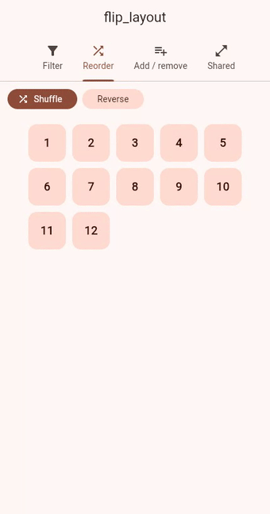
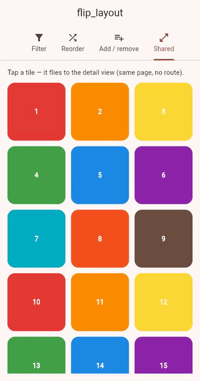

# flip_layout

[](https://pub.dev/packages/flip_layout)
[](LICENSE)

**Declarative layout, presence & shared-element animations for Flutter** —
change your state, and your UI animates itself. Inspired by
[Framer Motion](https://www.framer.com/motion/)'s `layout` prop,
`AnimatePresence`, and shared layout transitions.

> **Status:** early but usable. Core is covered by tests and runs on every
> platform (mobile, desktop, **web**).
>
> This README describes the library as it is now and carries no version
> numbers — the badge above is the current version, and
> [`CHANGELOG.md`](CHANGELOG.md) is the history.

## Why flip_layout?

Flutter has plenty of animation power, but for **collections** and **shared
elements** the tools are fragmented and mostly *imperative*:

- **`AnimatedList` / `SliverAnimatedList`** animate insert/remove — but only in a
  `ListView`, and you drive them by hand (a `GlobalKey<AnimatedListState>` +
  `insertItem`/`removeItem`, keeping your data and the list in sync yourself).
- **`AnimatedSize` / `ExpansionTile`** animate *size*, not position or presence.
- **`ReorderableListView`** animates drag-reorder — only that, only a list.
- **`Hero`** animates a shared element — but only **across routes**.
- **Implicit widgets** (`AnimatedContainer`, …) animate one widget's own
  properties, never a collection.

There's no single, **declarative** way to say *"here is a list of widgets in
whatever layout — animate them as the list changes."* That's the gap
`flip_layout` fills: change the `children` you pass and it works out **enter,
exit, and reflow** — in a `Wrap`, `GridView`, `Column`, or your own layout. Plus
a **within-page shared-element** transition: the missing *"`Hero`, but on one
screen."*

The design principle: **compose with Flutter's built-ins, don't replace them.**
Curves, springs, gestures — Flutter is great at those. `flip_layout` fills the
declarative-collection and same-page-shared-element voids they leave.

## See it

| Filter a `Wrap` (enter/exit) | Reorder (FLIP + spring) | Add / remove (enter/exit) |
|---|---|---|
|  |  |  |

Typing a query removes the non-matching chips (they fade out) and the survivors
slide up to fill the gaps — in a `Wrap`, which no Flutter built-in animates.

```bash
cd example && flutter run          # mobile / desktop
cd example && flutter run -d chrome # web
```

## Install

```bash
flutter pub add flip_layout
```

## `MotionGroup` — the main event

Give it a keyed list of children and a `builder` that arranges them. It handles
the rest:

```dart
MotionGroup(
  // adding/removing/reordering these just works
  children: [
    for (final tag in visibleTags)
      Chip(key: ValueKey(tag), label: Text(tag)),
  ],
  builder: (context, children) => Wrap(spacing: 8, children: children),
)
```

- **Enter** — new children fade + scale in.
- **Exit** — removed children are kept mounted and animated out *before* being
  removed (an `AnimatePresence` equivalent — Flutter can't otherwise animate a
  widget that's already gone from the tree).
- **Layout** — survivors slide (FLIP) to their new positions.
- `stagger` — delay between children entering, for a staggered reveal.
- `exitStagger` — delay between children *leaving*, so a batch cascades out.
- `transitionBuilder` / `exitTransitionBuilder` — customise the enter and
  (optionally separate) exit transitions. Default: fade + scale.
- `animateInitial` — whether the first batch animates in.
- `onEnter(key)` / `onExitComplete(key)` — lifecycle callbacks per child.
- `spring` — drive the reflow slide with velocity-preserving physics (below).

Every child **must** carry a unique `Key`.

> **Big lists?** `MotionGroup` animates **every** child at once (no
> virtualisation) and keeps exiting ones mounted, so it's for *modest*
> collections. A debug warning fires past
> `MotionGroup.debugChildCountWarningThreshold` (default 150). For long,
> scrolling lists use `AnimatedList` / `SliverAnimatedList`.

## Shared-element "magic move" — `Hero`, but within a page

Flutter's `Hero` only animates **across routes**. `MotionSharedScope` +
`MotionSharedId` animate a shared element **within the same page** — grid →
detail, expand-in-place, tab → tab, master → detail — with no route change:

<p align="center">
  
</p>

```dart
MotionSharedScope(
  // keep the grid mounted and LAYER the detail on top → scroll/state preserved,
  // and the element flies back to its tile automatically on close.
  child: Stack(children: [
    GridView(children: [
      for (final item in items)
        GestureDetector(
          onTap: () => setState(() => selected = item),
          child: MotionSharedId(id: item.id, child: Thumb(item)),
        ),
    ]),
    if (selected != null)
      Center(child: MotionSharedId(id: selected!.id, child: BigCard(selected!))),
  ]),
)
```

Give two widgets the same `id` under one scope; when one hands the id off to the
other, a copy flies from the old rect to the new one. Shared children should be
**size-flexible** (no fixed width/height) so the flight interpolates layout
smoothly.

By default the flight carries the destination child. When the two ends look
different, either dissolve between them with `crossFade: true`, or render a fully
custom in-flight widget with `flightShuttleBuilder`:

```dart
MotionSharedScope(
  crossFade: true, // built-in source→destination dissolve
  // …or take full control:
  flightShuttleBuilder: (context, animation, fromChild, toChild) =>
      FadeTransition(opacity: animation, child: toChild),
  child: ...,
)
```

### `MotionSharedId` vs `Hero`

|  | `Hero` | `MotionSharedId` |
|---|---|---|
| **When** | Across a **route** push/pop | **Within one page**, any state change |
| **Trigger** | A Navigator route transition | Matching the same `id` in two places |
| **Origin screen** | Previous route is torn down / covered | Stays mounted — scroll & state preserved |
| **Setup** | `Hero(tag:)` + navigate | Wrap a region in `MotionSharedScope`, match `id` |

Use `Hero` for real navigation; use `MotionSharedId` for grid→detail,
expand-in-place, tab→tab, and split-view master→detail — transitions that happen
*without* changing routes.

## `MotionConfig` — set defaults once

Wrap a subtree to give every `MotionGroup`/`LayoutMotion` below it the same
`duration`/`curve`/`stagger`, and to honour reduced-motion:

```dart
MotionConfig(
  duration: const Duration(milliseconds: 220),
  curve: Curves.easeOutBack,
  // reduceMotion: null → follows the OS "reduce motion" setting automatically
  child: MyPage(),
)
```

Precedence for any value: the widget's own argument → the nearest `MotionConfig`
→ a built-in default. When motion is reduced (config or the platform
accessibility setting), animations are skipped and changes apply instantly.

## Spring motion

Two flavours, depending on whether you want momentum:

**`SpringCurve`** — a spring *look* as a plain `Curve`. Pass it anywhere a curve
is accepted for a natural overshoot-and-settle over a fixed `duration`:

```dart
MotionGroup(
  duration: const Duration(milliseconds: 520),
  curve: SpringCurve(stiffness: 220, damping: 14),
  ...
)
```

**`MotionSpring`** — real, **velocity-preserving** physics for the position
slide. There's no fixed duration; the slide runs until it settles, and a
re-order *mid-slide* carries the element's momentum into the new target instead
of restarting. Pass it via `spring:` on `LayoutMotion`/`MotionGroup` (or set a
default on `MotionConfig`):

```dart
MotionGroup(
  spring: const MotionSpring(stiffness: 220, damping: 16),
  // (MotionSpring.gentle and MotionSpring.bouncy are ready-made presets)
  ...
)
```

For both, lower `damping` bounces more; higher `damping` settles without
overshoot.

## `LayoutMotion` — position-only, for a single widget

If you just want one widget to slide when *its own* position changes (and don't
need enter/exit), wrap it directly:

```dart
LayoutMotion(
  key: ValueKey(id),
  child: Card(child: ListTile(title: Text('Item $id'))),
)
```

It measures its untransformed bounds on each real layout change and animates from
the old position to the new one (the **FLIP** technique). Inside a `Scrollable`
it measures in scroll-content space, so plain scrolling doesn't trigger a
spurious slide, and slides are **interruptible** (a change mid-slide re-targets
from the current position rather than snapping).

## flip_layout vs Flutter's built-ins

| You want to… | Flutter built-in | flip_layout |
|---|---|---|
| Animate a `ListView`'s insert/remove | `AnimatedList` (imperative) | `MotionGroup` — **declarative, any layout** |
| Animate a `Wrap`/`GridView` on filter/sort | — *(none)* | `MotionGroup` |
| Enter **and exit** for conditional widgets | — *(no `AnimatePresence`)* | `MotionGroup` (exit-then-remove) |
| Slide siblings when one moves/reorders | — *(manual)* | `LayoutMotion` (FLIP) |
| Shared element **across routes** | `Hero` | *(use `Hero`)* |
| Shared element **within a page** | — *(none)* | `MotionSharedScope` / `MotionSharedId` |
| App-wide motion defaults + reduce-motion | — *(manual)* | `MotionConfig` |
| Expand/collapse **one** widget's size | `AnimatedSize` / `ExpansionTile` | *(use those)* |
| Drag-to-reorder a list | `ReorderableListView` | *(use that)* |

## When *not* to use this

Reach for a Flutter built-in when it already fits — don't fight it:

- **Expand / collapse one widget's size** → `AnimatedSize` or `ExpansionTile`.
  (Animating a *continuously* resizing widget with FLIP causes jitter, because
  FLIP is for **discrete** position changes.)
- **Drag-to-reorder a list** → `ReorderableListView`.
- **A huge, lazily-built list** → `AnimatedList` / `SliverAnimatedList`
  (virtualised).
- **Shared element across a route** → `Hero`.

`flip_layout` shines for **declarative** enter/exit + reflow of **collections in
arbitrary layouts** (filtered chips, tag grids, dashboards, kanban columns) and
**same-page shared elements** — the cases the built-ins don't cover.

## Performance

Measured on an Apple M3 Pro (`flutter test`, JIT — an AOT release build and real
GPU raster differ):

| Work | cost |
|---|---|
| full reorder of 60 / 150 / 300 elements | ~1.9 / 2.2 / 2.3 ms per frame (UI thread) |
| `SpringCurve()` construction | ~6.8 µs (runs a settle simulation) |

Reflow cost scales sub-linearly with element count — even 300 simultaneously
sliding children stay well under the 16.7 ms UI-thread budget. Two caveats:
construct a `SpringCurve` **once**, not per-frame inside `build()`; and these
headless numbers exclude GPU raster (compositing many transformed layers), which
is the real limit at high counts — measure it on-device.

Run it yourself: the example app has a **Stress** tab that drives a single
`MotionGroup` up to 300 churning children with a live FPS / build / raster /
jank readout (`flutter run --profile` for representative numbers).

## Known limitations

- Shared-element transitions are **within-page** (`MotionSharedScope`); for
  cross-*route* transitions use Flutter's `Hero`. Shared children should be
  size-flexible. The active holder is chosen by a **birth-order heuristic** that
  can mispick with 3+ simultaneous holders of one id (see
  [`doc/ARCHITECTURE.md`](doc/ARCHITECTURE.md)).
- Two spring options: `SpringCurve` gives a fixed-duration spring *look* (no
  momentum); `MotionSpring` is velocity-preserving physics but drives the
  **position slide only** (not the enter/exit fade-scale).
- `LayoutMotion.animateSize` interpolates size with `Transform.scale`, which
  visually stretches children — treat it as a visual-only effect for uniform
  boxes (or use `AnimatedSize`).
- Best for **modest collections**; there's no virtualisation. `MotionGroup`
  warns (debug) past `MotionGroup.debugChildCountWarningThreshold` — use
  `AnimatedList` / `SliverAnimatedList` for large scrolling lists.

See [`doc/API.md`](doc/API.md), [`doc/SPEC.md`](doc/SPEC.md) and
[`doc/ROADMAP.md`](doc/ROADMAP.md).

## License

MIT
